<div align="center">


# MindEcho · 铭心

> **不平则鸣，心有所感则鸣于声**

*AI 驱动的中文歌唱训练系统 — 实时音高检测 · 五线谱可视化 · 声乐教练 · ML 发声分析*

[](https://www.python.org/)
[](https://www.riverbankcomputing.com/software/pyqt/)
[](LICENSE)
[]()

</div>

---

## 📖 简介

**铭心（MindEcho）** 是一套面向声乐学习者的中文智能音频分析系统。它将麦克风输入送入实时音频管线，经多级降噪和 YIN 音高检测后渲染为 ECG 曲线与五线谱；同时集成了多后端 LLM 驱动的 AI 声乐教练、基于 SqueezeNet/EfficientNet 的发声技术分类器，以及 Demucs/Spleeter 人声伴奏分离引擎。

从练声打分到歌唱分析，从气息检测到换声点估算，铭心试图把计算机听觉的前沿能力带给每一个想唱得更好的人。

---

## ✨ 核心功能

### 🎤 实时音频管线

```
麦克风 → 多模式降噪 → YIN 音高检测 → 可视化渲染
```

- **YIN / 自相关 / FFT** 三种基频检测算法，默认 YIN 为主引擎
- **三级降噪**：频谱减法 + 50/60Hz 陷波滤波 + 音乐谐波保护
- **三档性能模式**：QUIET / BALANCED / HIGH_PERFORMANCE，适应不同硬件
- 频率 → MIDI 音符名 → cents 偏差实时换算
- 窗口参数可调（hop size、阈值），兼顾精度与感知延迟

<p align="center">
  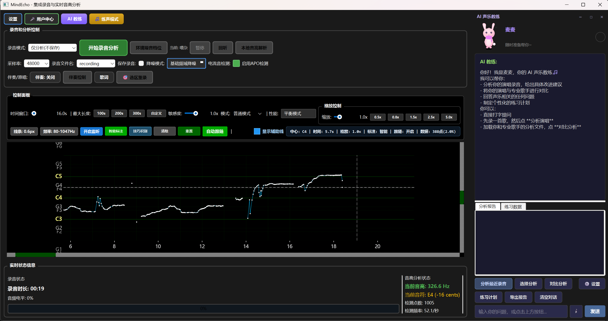
  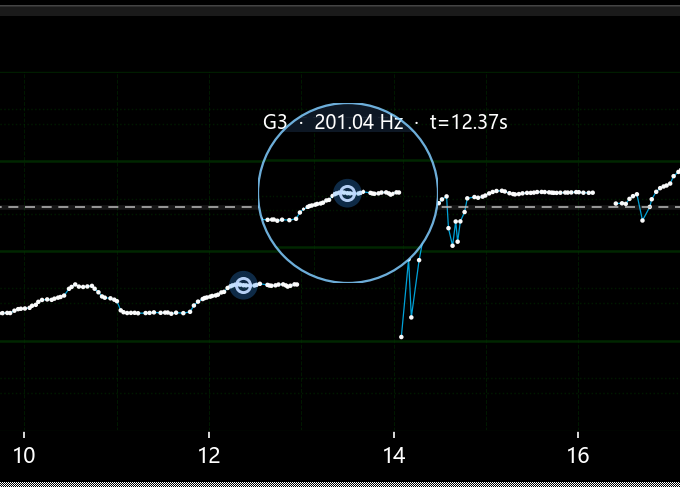
</p>
<p align="center"><em>左：实时音高追踪与五线谱渲染 | 右：频率曲线与音符偏差详情</em></p>

---

### 🤖 AI 声乐教练

集成了多后端 LLM 的智能声乐教练，具备演唱分析、问答、练习计划生成、联网搜索增强等能力。

| 能力 | 说明 |
|------|------|
| **多后端** | DeepSeek / Anthropic Claude / OpenAI / Ollama 本地模型，统一适配层 |
| **知识库** | YAML 结构化声乐课程 (基础/技巧/健康) + ChromaDB 向量语义检索 |
| **记忆系统** | 基于艾宾浩斯遗忘曲线的长期记忆，自动调度知识点复习 |
| **上下文构建** | 将音高统计、技术分布、声部分析 → LLM-readable 结构化上下文 |
| **教练人格** | 5 种教练角色 × 20 种主题配色，含 SVG 矢量吉祥物 |
| **报告生成** | 演唱后自动生成 Markdown / HTML 分析报告 |

<p align="center">
  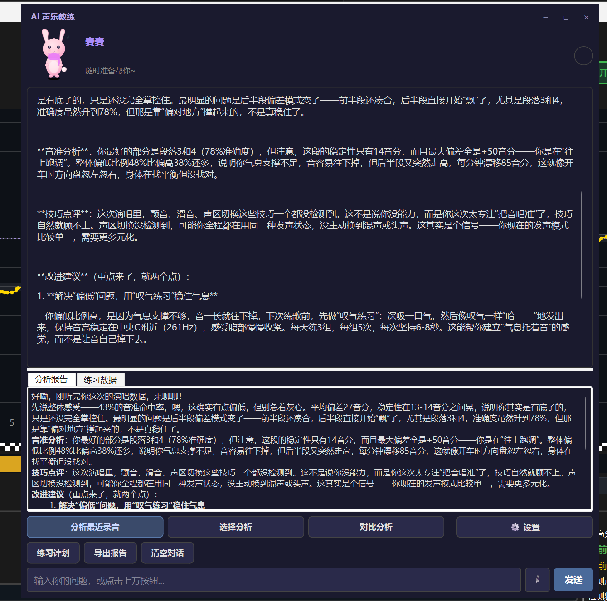
</p>
<p align="center"><em>AI 声乐教练对话界面 — 支持多轮问答、演唱分析和练习建议</em></p>

---

### 🏋️ 练声模式

专为日常音准训练设计的交互式打分系统。

- **实时命中判定**：Perfect / Great / Good / OK / Miss 五级评分
- **连击追踪**：连续命中 streak 统计，激励持续练习
- **丰富曲目库**：哼鸣暖声、C 大调单音匹配、音阶上下行、音程跳跃
- **自适应难度**：根据历史表现动态调整容差等级
- **训练统计**：音准准确率、稳定性、节奏、保持力四维评分

<p align="center">
  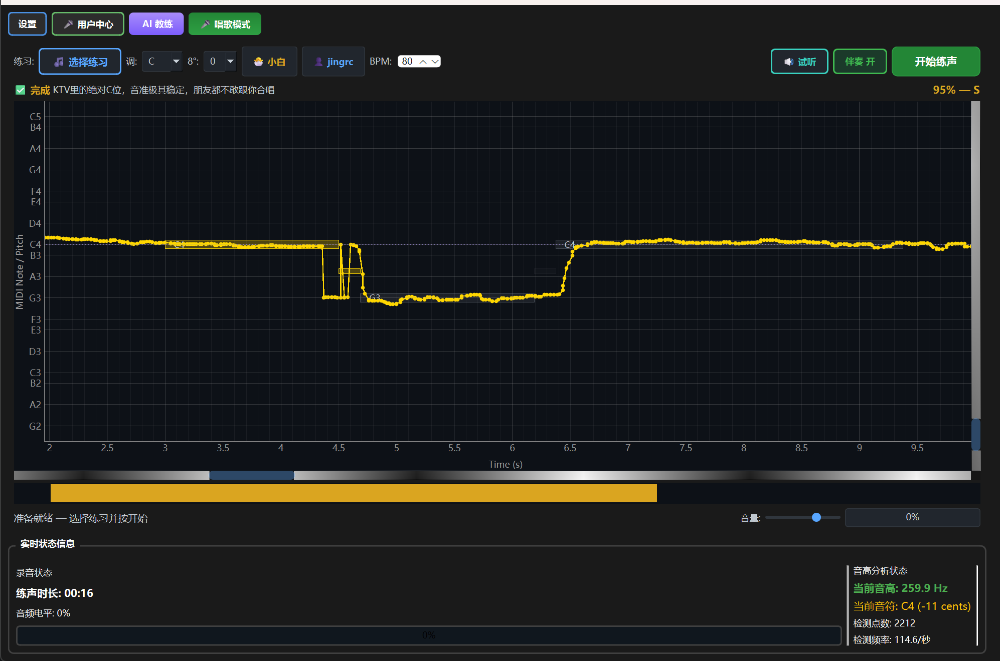
  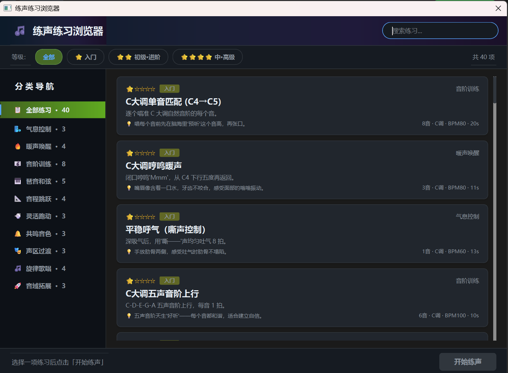
</p>
<p align="center"><em>左：练声模式实时打分 | 右：练习曲目库</em></p>

---

### 🎧 人声 / 伴奏分离

基于深度学习的音频源分离，支持主唱与和声的内部二次分离。

- **双引擎**：Demucs（PyTorch）/ Spleeter（TensorFlow）可切换
- **声纹嵌入**：自动识别并锁定主唱声纹，分离和声轨
- **近实时调度**：分块处理 + 重叠拼接，降低等待延迟
- **Opt-in 模式**：默认 pass-through，用户主动开启

---

### 🧠 ML 发声技术分类

轻量级神经网络实时识别歌唱发声方式。

| 模型 | 任务 | 架构 |
|------|------|------|
| 胸声 / 假声分类 | 二分类 & 四分类 | SqueezeNet, mel-spectrogram @22050Hz |
| 多技术分类 | 混声、气息、颤音等 | EfficientNet/SqueezeNet, late fusion |

<p align="center">
  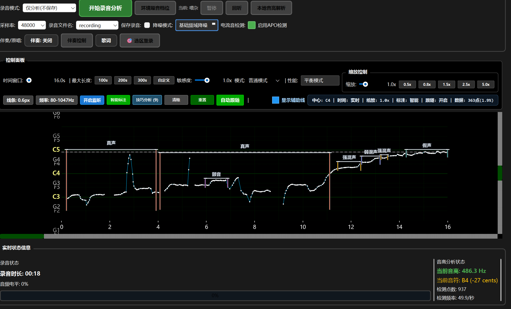
</p>
<p align="center"><em>ML 实时发声技术分类 — 胸声 / 假声 / 混声 / 气息检测</em></p>

---

### 🎵 歌曲音高解析

导入参考音频或专业歌手版本，与自己的录音做逐帧音高对比。

- **差异可视化**：你的音高曲线 vs 原唱 / 标准音高，偏差一目了然
- **段落标记**：按主歌/副歌等段落结构组织对比视图
- **技术分布**：自动统计各段落的发声技术使用比例

<p align="center">
  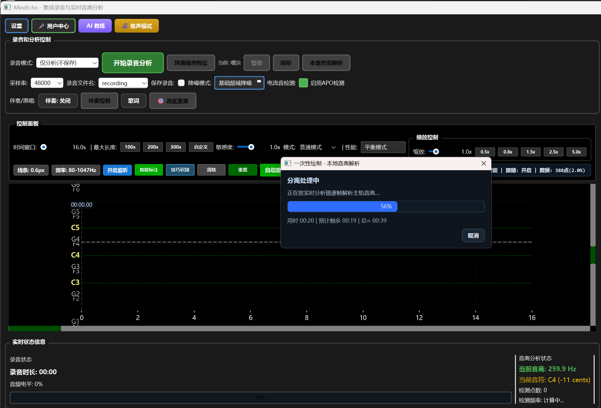
  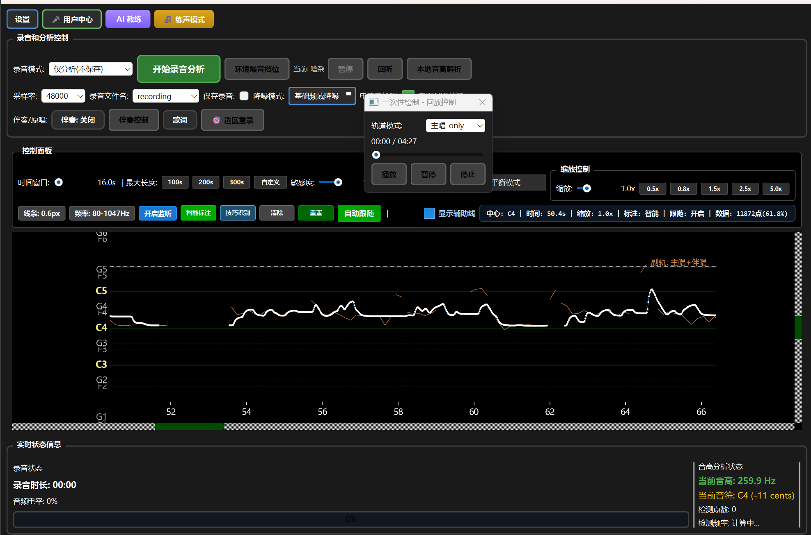
</p>
<p align="center"><em>左：音高曲线逐帧对比 | 右：分段分析详情报告</em></p>

---

### 👤 多用户系统

- 独立的用户配置文件，互不干扰
- 自动推断声部类型（男高音/男中音/女高音等）
- **换声点估算**：基于音高分布自动估计 passaggio，支持手动校准
- 训练历史追踪、进度可视化、等级评定

<p align="center">
  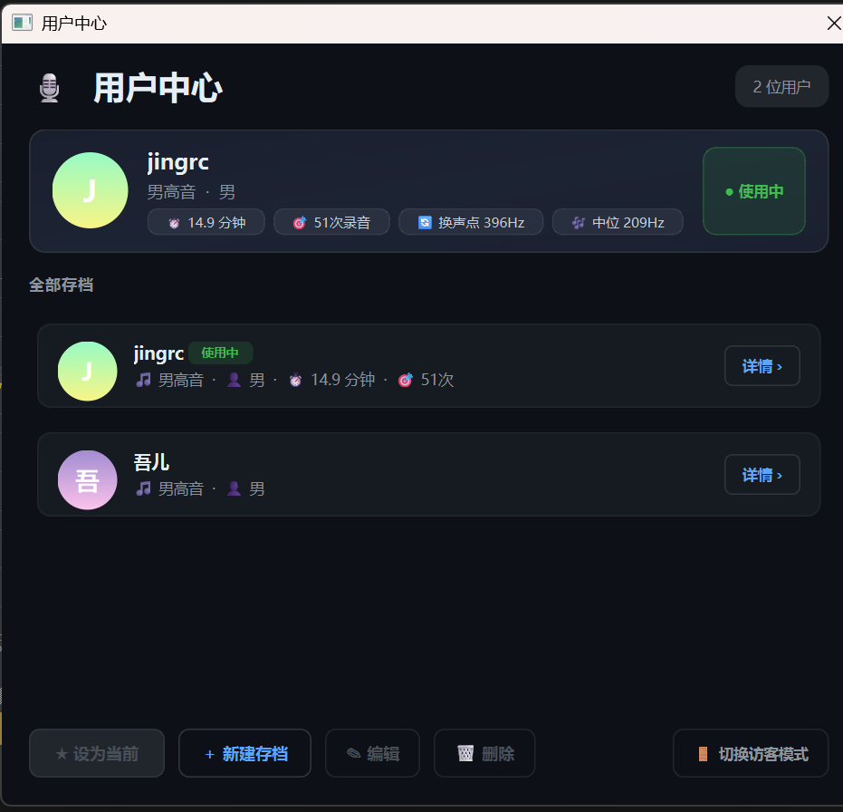
  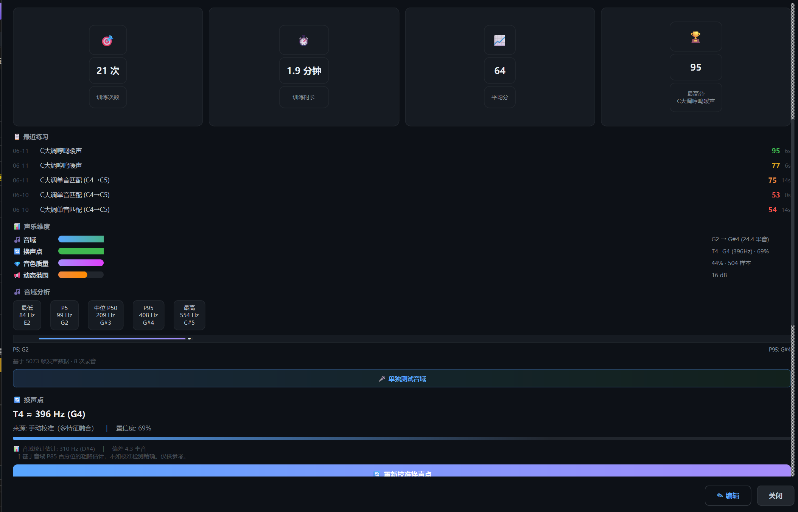
</p>
<p align="center"><em>左：多用户选择与切换 | 右：声乐档案与训练统计</em></p>

---

### 🎛️ 录音工作流

<p align="center">
  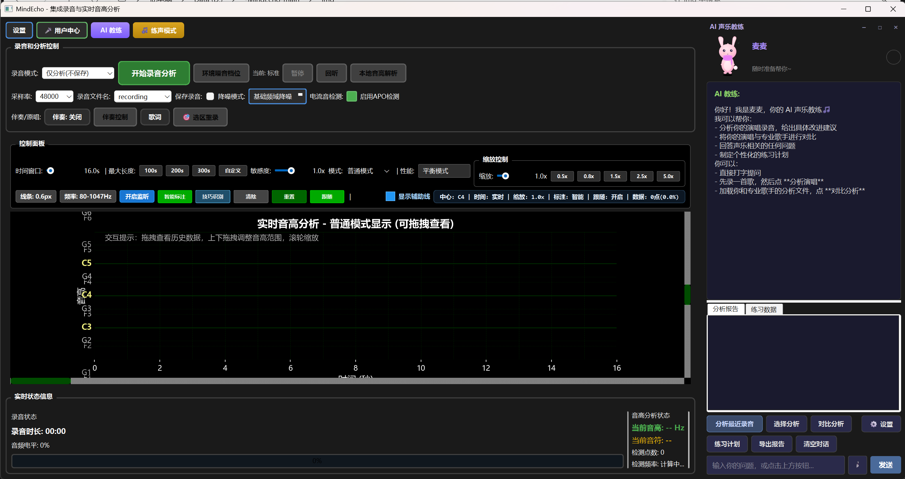
</p>
<p align="center"><em>主录音界面 — ECG 音高曲线 + 实时五线谱 + 控制面板</em></p>

- **耳返监听**：低延迟麦克风回放，可调音量/混音比例

<p align="center">
  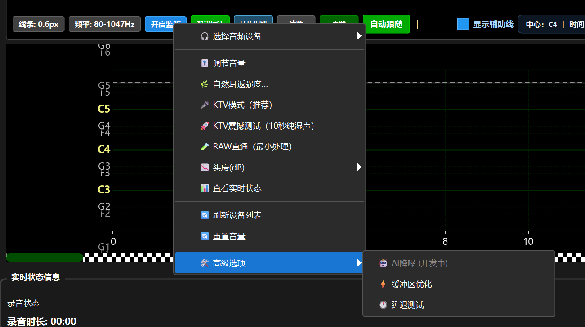
</p>

- **选区重录**：在已录音频上框选段落，只重录选中区域

<p align="center">
  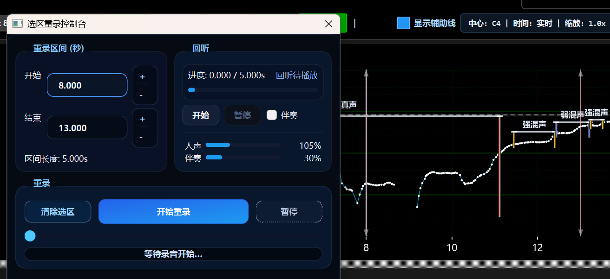
</p>

- **录音回放**：历史录音列表、波形预览、与参考音高叠加对比

<p align="center">
  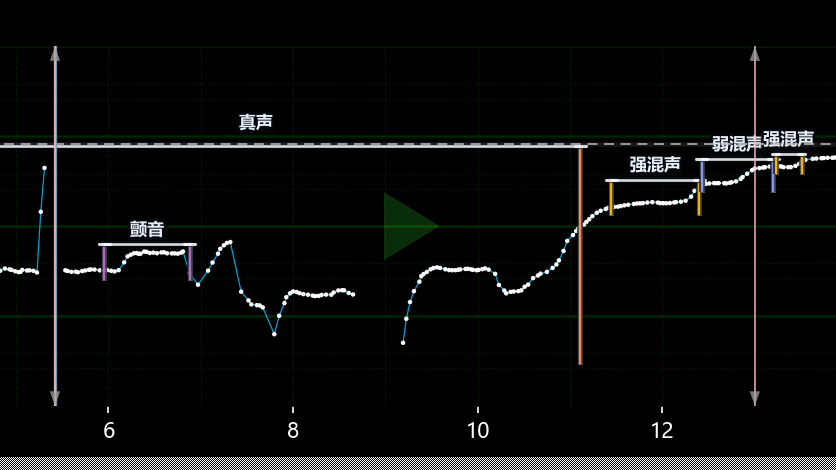
</p>

---

## 📋 系统要求

| 项目 | 最低 | 推荐 |
|------|------|------|
| **Python** | 3.9 | 3.11+ |
| **操作系统** | Windows 10 / macOS 11 / Ubuntu 20.04 | Windows 11 |
| **内存** | 4 GB | 8 GB+ |
| **音频设备** | 支持 WASAPI/CoreAudio/ALSA 的麦克风 | 外置声卡 + 电容麦 |

---

## 🛠️ 快速开始

### 1. 克隆仓库

```bash
git clone https://github.com/JingRC/MindEcho.git
cd MindEcho
```

### 2. 安装核心依赖

```bash
pip install numpy scipy sounddevice matplotlib PyQt6
```

### 3. 启动

```bash
# 直接启动主界面（推荐）
python main.py

# 或使用菜单式启动器
python run_enhanced.py
```

### 4. 可选：安装 ML / AI Coach 扩展

```bash
# AI Coach + 人声分离（需要 PyTorch 或 TensorFlow）
pip install -r requirements-optional.txt
```

---

## 🔧 配置

首次启动后，在 AI Coach 设置面板中配置 LLM 后端。也可以直接编辑 `~/.mindecho/config.json`：

```json
{
  "llm": {
    "provider": "deepseek",
    "api_key": "你的 API Key",
    "model": "deepseek-chat",
    "max_tokens": 4096,
    "temperature": 0.7
  }
}
```

项目提供 [config.template.json](config.template.json) 作为配置参考模板。
**⚠️ 请勿将含真实 API Key 的配置文件提交到 Git。**

---

## 📁 项目结构

```
MindEcho/
├── src/
│   ├── audio_processing/          # 音频管线核心
│   │   ├── recorder.py            # 非阻塞音频流捕获
│   │   ├── pitch_service.py       # 音高检测统一入口 (YIN)
│   │   ├── noise_reduction.py     # 多模式降噪处理器
│   │   ├── performance_manager.py # 三档性能调度
│   │   └── lead_backing/          # 人声/伴奏分离管线
│   │       ├── lead_backing_pipeline.py  # Demucs/Spleeter 编排
│   │       ├── singer_embedding.py      # 声纹嵌入与主唱识别
│   │       └── realtime_chunk_scheduler.py  # 近实时分块调度
│   │
│   ├── ai_coach/                  # AI 声乐教练子系统
│   │   ├── agent.py               # VocalCoachAgent 主编排
│   │   ├── llm_client.py          # LLM 多后端统一适配
│   │   ├── config.py              # 配置管理 (密钥安全存储)
│   │   ├── context/               # 提示工程：音高数据 → LLM 上下文
│   │   ├── knowledge/             # YAML 知识库 + ChromaDB 向量检索
│   │   ├── memory/                # 艾宾浩斯遗忘曲线长期记忆
│   │   ├── session/               # 用户画像与练习历史
│   │   ├── analysis/              # 音高对比 + 报告生成
│   │   ├── identity.py            # 教练人格与吉祥物配色
│   │   ├── search.py              # 联网搜索增强
│   │   └── gui/                   # Coach UI 组件
│   │
│   ├── analysis/                  # 音高检测与乐理
│   │   ├── pitch_detection.py     # YIN/自相关/FFT 算法 + MIDI 转换
│   │   └── staff_visualizer.py    # 五线谱渲染引擎
│   │
│   └── gui/                       # 图形界面
│       └── integrated_recording_interface.py  # 主界面巨石组件
│
├── ml_dl_models/                  # ML 模型（仅代码，不含权重）
│   ├── chest_falsetto/            # 胸声/假声分类 (SqueezeNet)
│   └── gtsinger_multitech/        # 多技术分类 (EfficientNet)
│
├── main.py                        # 主启动入口
├── run_enhanced.py                # 菜单式启动器
├── CLAUDE.md                      # 项目架构文档（面向 AI 工具）
├── config.template.json           # 配置参考模板
└── img/                           # 界面截图与 Logo
```

---

## 🏗️ 架构概览

```
┌──────────────────────────────────────────────────────────┐
│                     MindEcho · 铭心                        │
├──────────────────────────────────────────────────────────┤
│  GUI Layer (PyQt6)                                        │
│  ┌──────────┬──────────┬──────────┬──────────────────┐   │
│  │ ECG 可视化 │ 五线谱    │ Coach UI │ 练声模式 / 用户管理 │   │
│  └──────────┴──────────┴──────────┴──────────────────┘   │
├──────────────────────────────────────────────────────────┤
│  Audio Pipeline                                           │
│  Mic → NoiseReduction → PitchDetection → Visual Render   │
├──────────────────────────────────────────────────────────┤
│  AI Coach Subsystem                                       │
│  LLM Client ← Context Builder ← Pitch Stats              │
│       ↓                                                   │
│  Knowledge Retriever (YAML + ChromaDB)                    │
│  Memory Manager (Ebbinghaus Scheduler)                    │
├──────────────────────────────────────────────────────────┤
│  ML Inference (opt-in)                                    │
│  Chest/Falsetto ← SqueezeNet · Multi-tech ← EfficientNet │
│  Lead/Backing ← Demucs / Spleeter                         │
└──────────────────────────────────────────────────────────┘
```

---

## 📄 许可证

本项目采用 [MIT License](LICENSE) 开源。

**注意**：项目仓库中**不包含**预训练模型权重、用户数据、测试脚本和 ML 训练中间产物。如需模型权重，请通过 GitHub Releases 或 Issue 联系获取。

---

<div align="center">

**铭心** — 每一次发声，都值得被听见、被理解、被回应。

[提交 Issue](https://github.com/JingRC/MindEcho/issues) · [功能请求](https://github.com/JingRC/MindEcho/issues/new)

</div>
