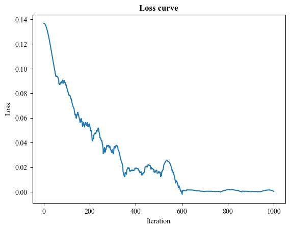
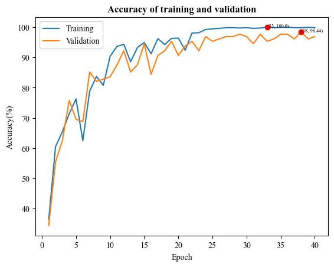
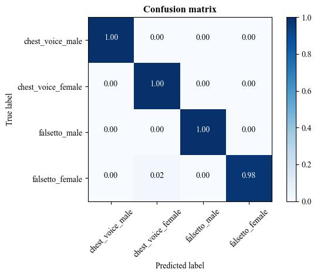

---
frameworks:
- Pytorch
license: MIT License
tasks:
- audio-classification
---

# 简介 Intro
真假声判别模型的设计旨在有效区分音频样本中的真实声音和伪声音，其中判别的类别涵盖男真声、男假声、女真声和女假声四个具体类别。该模型的训练基于计算机视觉（CV）领域的骨干网络，通过将音频数据转换成频谱图并经过微调，以提高网络对不同类别声音的准确识别能力。在训练过程中，采用了包含真实和伪声音样本的数据集，以确保模型能够充分学习并捕捉与男女真假声相关的特征。通过这一方法，模型能够细致地对不同性别和真伪声进行分类，为音频真伪声的准确判别提供了可靠的解决方案。这一模型在语音处理、音乐制作等领域中具有广泛的应用潜力，为音频分析和处理提供了一种高效而精确的工具。其基于计算机视觉原理的训练和微调策略突显了模型在不同领域的适应性和鲁棒性，为进一步研究和应用提供了有益的范例。

The design of the true and false voice discrimination model aims to effectively distinguish between genuine and false voices in audio samples, covering four specific categories: male chest voice, male falsetto voice, female chest voice, and female falsetto voice. The model's training is based on backbone networks from the field of computer vision (CV), by converting audio data into spectrograms and fine-tuning them to enhance the network's ability to accurately recognize different categories of voices. During the training process, a dataset containing both genuine and false voice samples is used to ensure that the model can fully learn and capture features related to true and false voices of both genders. Through this approach, the model can meticulously classify different genders and true and false voices, providing a reliable solution for accurate voice authenticity discrimination. This model has wide-ranging applications in fields such as speech processing and music production, offering an efficient and precise tool for audio analysis and processing. Its training and fine-tuning strategies based on computer vision principles highlight the model's adaptability and robustness across various domains, providing a beneficial paradigm for further research and application.

## 在线演示 Demo (推理代码)
<https://www.modelscope.cn/studios/ccmusic-database/chest_falsetto>

## 使用 Usage
:modelscope-code[]{type="sdk"}

## 维护 Maintenance
```bash
GIT_LFS_SKIP_SMUDGE=1 
```

:modelscope-code[]{type="git"}

## 训练结果 Results
|     Backbone      |                 Mel                  |     CQT     |   Chroma    |
| :---------------: | :----------------------------------: | :---------: | :---------: |
|     Swin-S V2     |             **_0.968_**              |    0.268    | **_0.268_** |
|     MaxViT-T      |                0.820                 | **_0.933_** |    0.250    |
|                   |                                      |             |             |
|      AlexNet      | [**_0.994_**](#最佳结果-best-result) | **_0.963_** | **_0.586_** |
| ShuffleNet V2 2.0 |                0.939                 |    0.669    |    0.222    |
|     GoogleNet     |                0.983                 |    0.274    |    0.292    |
|    MNASNet-A3     |                0.756                 |    0.260    |    0.320    |
|  SqueezeNet 1.1   |                0.963                 |    0.900    |    0.378    |
|      Average      |                0.918                 |    0.610    |    0.331    |

### 最佳结果 Best Result
<table>
    <tr>
        <th>Loss curve</th>
        <td></td>
    </tr>
    <tr>
        <th>Training and validation accuracy</th>
        <td></td>
    </tr>
    <tr>
        <th>Confusion matrix</th>
        <td></td>
    </tr>
</table>

## 数据集 Dataset
<https://www.modelscope.cn/datasets/ccmusic-database/chest_falsetto>

## 镜像 Mirror
<https://huggingface.co/ccmusic-database/chest_falsetto>

## 评估 Evaluation
<https://github.com/monetjoe/ccmusic_eval>

## 引用 Cite
```bibtex
@dataset{zhaorui_liu_2021_5676893,
  author    = {Zhaorui Liu and Zijin Li},
  title     = {Music Data Sharing Platform for Computational Musicology Research (CCMUSIC DATASET)},
  month     = nov,
  year      = 2021,
  publisher = {Zenodo},
  version   = {1.1},
  doi       = {10.5281/zenodo.5676893},
  url       = {https://doi.org/10.5281/zenodo.5676893}
}
```